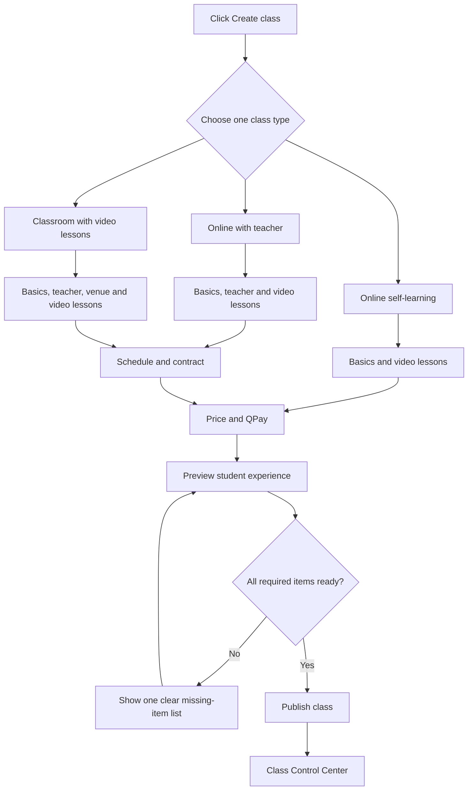
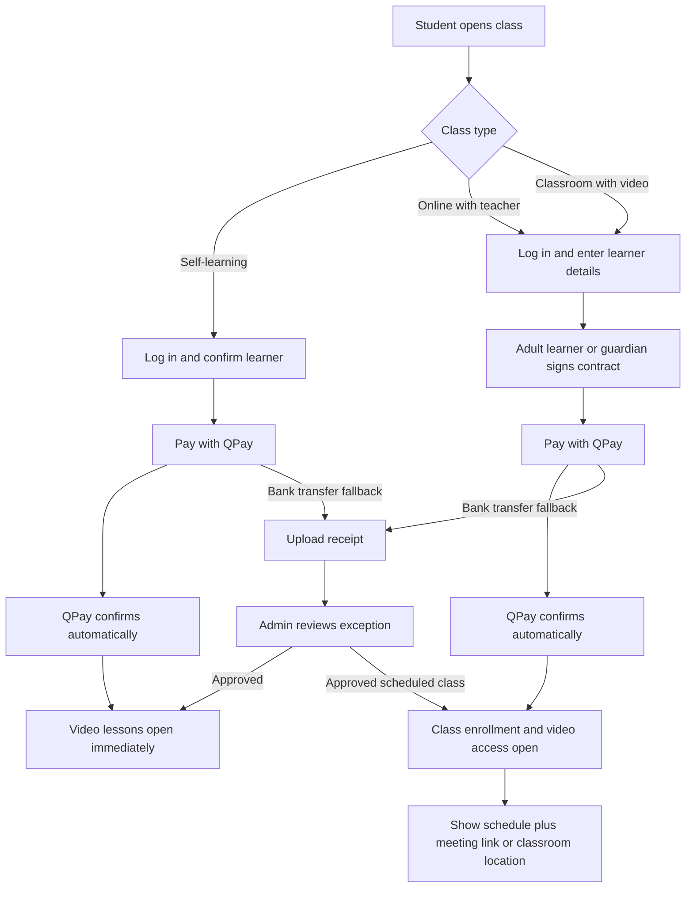
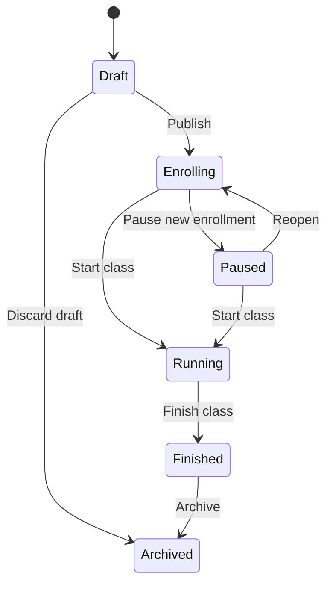

# Mind Academy class control refactor

Status: proposed production architecture. No database or live workflow change is authorized by this document alone.

## Goal

An administrator should be able to create, publish, change, monitor, and finish a class without understanding database tables, checkout versions, cohorts, entitlements, or payment snapshots.

The admin interface will expose one main concept: **Class**.

The system will continue to preserve separate content, contract, payment, enrollment, and access records behind the interface because those records protect financial and legal history.

## Current production model

The current implementation contains these separate concepts:

1. **Video content (`courses`)** — lessons and videos that students can watch.
2. **Program (`training_programs`)** — a stable public/commercial grouping.
3. **Offering/class (`training_cohorts`)** — price, dates, delivery, capacity, contract and registration state.
4. **Application** — learner, applicant and guardian information.
5. **Contract acceptance** — an immutable signed snapshot when a contract is required.
6. **Payment** — QPay or manually reviewed bank-transfer evidence.
7. **Enrollment and entitlement** — the learner's class place and the account's video access.

The safety model is good, but the admin UI currently asks the administrator to assemble these parts manually. It also exposes old checkout terminology and old payment tabs beside the current flow.

Current production data includes both legacy and current records, so the refactor must be additive and backward compatible. Old records remain readable; all new classes use the new control experience.

## Problems to solve

- “Program”, “content”, “class / enrollment”, and “course” sound like the same thing in the interface.
- A large class editor shows too many fields and technical warnings at once.
- Delivery mode and contract policy are separate choices even though Mind Academy has only three valid business types.
- Teacher assignment and live-class meeting details do not have a real class-level model.
- Applications and payments are split across legacy and current screens.
- Safe changes are possible, but the administrator must understand snapshots and revisions to use them.
- A small change can look dangerous because editable, historical, and immutable information appear together.

## One vocabulary for administrators

| Admin word | Meaning | Existing technical record |
| --- | --- | --- |
| Class | The thing Mind Academy sells and operates | Training cohort/offering |
| Video lessons | Reusable learning content | Course and lessons |
| Class edition | A copied future version when a locked rule must change | New draft offering |
| Students | People enrolled in one class | Learners and enrollments |
| Payment | QPay or bank transfer attached to one student/class | Offering payment |
| Contract | The version accepted by the learner or guardian | Contract acceptance snapshot |

“Program”, “cohort”, “offering”, “checkout version”, and “entitlement” should not appear in normal admin screens.

## The three class types

The class type is a business rule, not a category.

| Class type | Admin label | Teacher | Contract | Video lessons | Schedule/location | Enrollment after QPay |
| --- | --- | --- | --- | --- | --- | --- |
| `self_paced_online` | Online self-learning | None | None | Required | No fixed location; access period only | Automatic and immediate |
| `instructor_led_online` | Online with teacher | Required | Required | Required or supplementary | Start/end, live schedule and meeting link | Automatic after signed contract and paid QPay |
| `offline_with_video` | Classroom with video lessons | Required | Required | Required | Start/end, schedule and physical location | Automatic after signed contract and paid QPay |

Selecting a type automatically sets the internal delivery and contract rules:

- Online self-learning → `delivery_mode=online`, `contract_policy=none`
- Online with teacher → `delivery_mode=online`, `contract_policy=required`
- Classroom with video lessons → `delivery_mode=offline`, `contract_policy=required`

The administrator must not choose these rules separately.

## Proposed admin navigation

```text
Dashboard
Classes
  Needs attention
  Draft
  Enrolling
  Running
  Finished
Students
Payments
Video library        (advanced)
Contract templates   (advanced)
Questions
Settings
```

Legacy records remain available through a small **History / legacy records** filter. They should not occupy the main daily workflow.

## Class Control Center

Every class opens one overview page with five sections:

1. **Next action** — one clear instruction such as “Choose video lessons” or “Ready to publish”.
2. **Class summary** — type, status, price, dates, teacher and enrollment count.
3. **Students** — enrolled, waiting, incomplete payment and contract problems.
4. **Payments** — paid, pending, failed and manual-review exceptions for this class.
5. **Settings and history** — editable settings, locked settings and audit history.

Primary actions remain visible:

- Preview
- Publish / pause enrollment
- Edit class
- Create new edition
- Finish class

Technical revision numbers, RPC names, checkout versions and snapshot details remain hidden under an advanced audit panel.

## Admin creation flow



### Creation wizard

The wizard should have no more than five short steps:

1. **Type and basics** — type, name, public description and thumbnail.
2. **Learning** — select or create the video lesson package.
3. **People and schedule** — only fields needed by the selected type.
4. **Contract and payment** — contract is automatic by type; select the template when required, then enter price and payment methods.
5. **Review and publish** — preview exactly what a student will see and show one readiness checklist.

The wizard saves a draft after every step. Leaving the page must not lose work.

## Student flows



QPay is the normal path. A successful QPay payment must not require a second admin approval. Bank transfer is the exception path and remains manually reviewed.

## Class lifecycle

Use plain admin states:



Self-learning classes can remain **Enrolling** indefinitely and do not need the **Running** state. Scheduled classes use the complete lifecycle.

## Safe editing rules

The admin selects **Edit class**. The system decides how to save the change.

### Safe live changes

These changes stay on the same class and are recorded in history:

- Public description and thumbnail
- Enrollment closing time
- Capacity
- Teacher, live schedule, meeting link or classroom location
- Payment method availability
- Price for future unpaid students only

Before saving, show a short impact message such as:

> Applies to 12 future students. Existing paid students keep their original price.

Schedule, teacher, meeting-link or venue changes affecting enrolled students should create a notification task.

### Locked after the first application/payment

These changes create a **new class edition** instead of rewriting history:

- Class type
- Contract requirement or signed contract version
- Main video lesson package
- Currency
- Previously captured payment or legal snapshots

The interface should say:

> This setting has student history. We will copy this class into a new draft so nothing is lost.

The administrator clicks **Create edition**; the system copies the safe defaults and opens the new draft automatically.

## Data architecture changes

Keep the current financial and legal tables. Add a small control layer:

1. Add `class_type` to `training_cohorts` with the three allowed values.
2. Backfill existing V2 records from delivery and contract rules; mark ambiguous legacy records as legacy instead of guessing.
3. Add class-level teacher assignment. Prefer a separate assignment table so teacher history is retained.
4. Add scheduled session records for date/time, online meeting link or classroom location.
5. Keep meeting links readable only by authorized staff and enrolled students.
6. Derive delivery and contract policy from class type in one database function; do not trust only the browser form.
7. Keep existing application, contract, payment, enrollment, and entitlement snapshots unchanged.
8. Build one read model/query for the Class Control Center instead of making the page assemble many unrelated queries.

Recommended relationship:

```text
Class
├── class type and lifecycle
├── video lesson package
├── teacher assignment
├── sessions / schedule / location
├── contract template version
├── payment configuration
└── students
    └── application → contract snapshot → payment → enrollment → video access
```

## Refactor sequence

### Phase 1 — control layer, no checkout rewrite

- Add and backfill class type.
- Create the new Classes list and Class Control Center.
- Combine existing data into one admin view.
- Keep all existing student and payment behavior unchanged.

Release gate: old and new production records are visible and no payment/enrollment changes.

### Phase 2 — guided class wizard

- Add the three type cards.
- Show only fields required by the selected type.
- Auto-select contract and delivery rules.
- Add readiness checklist, autosaved draft and student preview.

Release gate: create one draft of every type, preview it, then delete only those unused drafts.

### Phase 3 — teacher and schedule model

- Assign teachers to scheduled classes.
- Add live sessions/meeting links and offline venue details.
- Show the correct information to enrolled students.
- Add change notifications for enrolled students.

Release gate: one teacher-led online class and one offline class work end to end.

### Phase 4 — unified operations

- Add one Needs Attention inbox.
- Make QPay automatic success the default path.
- Keep manual bank-transfer review as an exception.
- Move legacy applications/payments into History filters.

Release gate: admin can run a class without opening legacy pages.

### Phase 5 — remove old UI only

- Observe production use first.
- Remove legacy navigation only after old records remain accessible in read-only history.
- Do not delete legacy database records.

## Simple acceptance tests

### Test A — self-learning class

1. Admin clicks **Create class**.
2. Choose **Online self-learning**.
3. Add name, video lessons and 500 MNT test price.
4. Preview, then publish.
5. Student pays 500 MNT by QPay.
6. Confirm the video opens immediately.
7. Confirm no teacher or contract was requested.

### Test B — online class with teacher

1. Choose **Online with teacher**.
2. Select teacher, dates, live schedule, meeting link, video lessons and contract.
3. Publish.
4. Student or guardian signs the contract and pays 500 MNT.
5. Confirm the student sees the schedule, meeting information and video lessons.

### Test C — classroom with video lessons

1. Choose **Classroom with video lessons**.
2. Select teacher, dates, venue, video lessons and contract.
3. Publish.
4. Student or guardian signs and pays 500 MNT.
5. Confirm the student sees the venue, schedule and video lessons.

### Test D — safe change

1. Open a class containing a paid student.
2. Change the future price.
3. Confirm the existing payment remains unchanged.
4. Try to change the class type.
5. Confirm the system offers a new draft edition instead of changing history.

## First implementation slice

Build **Phase 1** first. It gives immediate operational clarity while preserving the QPay flow that has already been proven in production. Do not begin by replacing payment, contracts, or enrollment tables.
